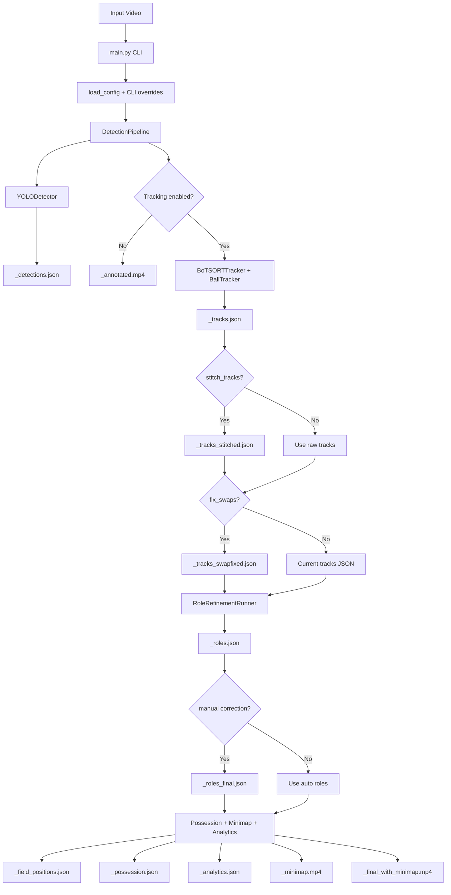

# Football AI - Workflow & Architecture

> الملف ده بيوثق الـ workflow والـ architecture الحاليين من الكود نفسه، خصوصا `main.py`,
> `config/config.yaml`, وملفات الـ modules. الـ `README.md` فيه كلام قديم شوية عن Phase 2،
> لكن الكود الحالي واصل لحد tracking, roles, manual correction, calibration, minimap,
> speed/distance analytics, possession, وfinal overlay.

## Quick Start

من داخل فولدر `football_ai`:

```powershell
python -m venv .venv
.\.venv\Scripts\activate
pip install -r requirements.txt
```

حط weights الكشف الأساسية هنا:

```text
weights/best.pt
```

تشغيل كل المشروع مرة واحدة:

```powershell
python main.py --video input_video.mp4 --all --device auto
```

أو باستخدام السكريبت الجاهز:

```powershell
.\run_all.ps1 input_video.mp4 auto
```

النتيجة النهائية المتوقعة:

```text
outputs/<video_stem>_final_with_minimap.mp4
```

## Big Picture

المشروع عبارة عن pipeline فيديو كرة قدم:

1. يقرأ فيديو match.
2. يعمل object detection للكرة، اللاعبين، الحارس، والحكم.
3. يحول detections إلى stable track IDs.
4. ينظف الـ IDs بعد التتبع: stitching وswap correction.
5. يعمل role/team refinement لكل track.
6. يسمح بتصحيح يدوي للـ roles/teams عند الحاجة.
7. يعمل pitch calibration وproject للـ tracks على أرضية الملعب بالمتر.
8. يطلع minimap وfinal video فيه boxes/roles/minimap/analytics.
9. يحسب possession, speed, distance.



## Main Entrypoints

| File | Role |
|---|---|
| `main.py` | الـ orchestrator الرئيسي: CLI args, config overrides, تشغيل كل phase بالترتيب. |
| `run_all.ps1` | PowerShell wrapper بيشغل `python main.py --video ... --all`. |
| `run_all.sh` | Bash wrapper لنفس فكرة `run_all.ps1`. |
| `manual_correction/__main__.py` | CLI منفصل للـ review/apply/initialize بدون إعادة detection/tracking. |
| `calibration/calibration_ui.py` | UI يدوي للـ pitch calibration لما مفيش calibration جاهز. |

## Folder Architecture

```text
football_ai/
  main.py
  config/
    config.yaml
  detection/
    detector.py
    data_models.py
    pipeline.py
  tracking/
    tracker.py
    botsort_tracker.py
    ball_tracker.py
    track_stitcher.py
    swap_corrector.py
    track_exporter.py
    track_visualizer.py
    models.py
  role_refinement/
    appearance_extractor.py
    team_clusterer.py
    role_refiner.py
    role_exporter.py
    role_visualizer.py
    role_models.py
  manual_correction/
    correction_runner.py
    correction_models.py
    correction_store.py
    correction_ui.py
    correction_tk_ui.py
    initialization.py
    team_legend.py
  calibration/
    calibration_store.py
    calibration_ui.py
    homography.py
    pitch_keypoints.py
    nbjw_keypoints.py
    camera_motion.py
    minimap.py
    pitch_model.py
  analytics/
    possession.py
    speed_distance.py
    analytics_exporter.py
    analytics_visualizer.py
    analytics_models.py
  visualization/
    annotator.py
    pose_overlay.py
  utils/
    config_loader.py
    video_io.py
    json_exporter.py
    fps_meter.py
    logger.py
  tests/
  outputs/
  weights/
```

## Core Design Rules

1. **Typed contracts بين المراحل**

   - Detection يستخدم `Detection` و`FrameDetections`.
   - Tracking يستخدم `Track` و`FrameTracks`.
   - Role refinement يستخدم `RoleResult` و`TrackAppearance`.
   - Manual correction يستخدم `ReviewCandidate`, `Correction`, `FinalRole`.
   - Analytics يستخدم `TrackAnalytics`, `AnalyticsResult`.

2. **Ultralytics مش بتطلع برا wrapper**

   `YOLODetector` هو المكان الأساسي اللي بيتعامل مع YOLO detection.
   `BoTSORTTracker` بيتعامل مع Ultralytics tracker داخليا، لكن باقي المشروع
   يستقبل dataclasses عادية.

3. **كل phase بتطلع artifact منفصل**

   raw detections محفوظة، raw tracks محفوظة، stitched/swapfixed tracks محفوظين،
   auto roles محفوظة، وfinal corrected roles محفوظة. ده بيخلي debugging أسهل.

4. **Post-processing مستقل**

   role refinement, manual correction, minimap, possession, analytics كلهم بيقرأوا
   JSON/objects من المراحل اللي قبلهم بدل coupling مباشر مع detector/tracker.

5. **Human input مش بيكسر run**

   لو calibration أو corrections مش موجودين، الكود إما يعرض prompt في terminal
   interactive أو يكمل safely ويعمل skip للجزء اللي ناقص.

## CLI Workflow

### Detection فقط

```powershell
python main.py --video input_video.mp4
```

بيطلع:

```text
outputs/input_video_annotated.mp4
outputs/input_video_detections.json
outputs/logs/run_*.log
```

### Detection + Tracking

```powershell
python main.py --video input_video.mp4 --tracking
```

بيطلع كمان:

```text
outputs/input_video_tracks.json
```

### Tracking cleanup

```powershell
python main.py --video input_video.mp4 --tracking --stitch-tracks --fix-swaps
```

بيطلع:

```text
outputs/input_video_tracks_stitched.json
outputs/input_video_tracks_swapfixed.json
```

### Role refinement

```powershell
python main.py --video input_video.mp4 --role-refinement
```

بيفعل tracking تلقائيا وبيطلع:

```text
outputs/input_video_roles.json
```

### Full run

```powershell
python main.py --video input_video.mp4 --all --device auto
```

`--all` بيشغل:

- tracking
- track stitching
- ID swap correction
- role refinement
- apply saved manual corrections لو موجودة
- minimap overlay
- possession
- speed/distance analytics
- pose skeleton overlay
- auto calibration لو keypoint model موجود، أو manual calibration path لو محتاج

### Reuse old tracks

```powershell
python main.py --video input_video.mp4 --all --reuse-tracks
```

ده مهم بعد manual labels. الكود بيدور بالترتيب على:

1. `outputs/<stem>_tracks_swapfixed.json`
2. `outputs/<stem>_tracks_stitched.json`
3. `outputs/<stem>_tracks.json`

لو لقى واحد منهم، بيستخدمه وبيعدي detection/tracking/stitching/swap correction
عشان track IDs تفضل ثابتة مع labels/corrections القديمة.

## Phase 0 - Config & Overrides

المسار:

```text
main.py -> parse_args -> load_config -> apply_overrides -> DetectionPipeline / post-processing
```

`utils/config_loader.py` بيقرأ `config/config.yaml` في dataclasses:

| Config section | Meaning |
|---|---|
| `model` | weights, device, confidence, iou, image size, per-class thresholds. |
| `classes` | class id to name map: ball, goalkeeper, player, referee. |
| `video` | output dir, save video, codec. |
| `visualization` | box style and colors. |
| `debug` | live window and debug frame dumping. |
| `tracking` | BoT-SORT, ByteTrack option, ball tracker, stitching, swap correction. |
| `role_refinement` | team clustering and role decision thresholds. |
| `manual_correction` | review candidates, correction files, review dataset paths. |
| `calibration` | manual/auto homography, keypoint models, camera motion smoothing. |
| `minimap` | dot colors, smoothing, tactical style. |
| `minimap_overlay` | picture-in-picture placement. |
| `possession` | ball possession gate and smoothing. |
| `pose` | optional YOLO pose overlay. |
| `analytics` | speed/distance settings. |

CLI flags override YAML values. مثال:

```powershell
python main.py --video input_video.mp4 --conf 0.4 --device cuda:0 --output-dir outputs2
```

## Phase 1 - Detection

المسار:

```text
DetectionPipeline.run
  -> VideoReader
  -> YOLODetector.detect(frame)
  -> DetectionJSONExporter.add_frame
  -> DetectionAnnotator / TrackVisualizer
  -> VideoWriter
```

الموديولات:

| Module | Responsibility |
|---|---|
| `detection/detector.py` | تحميل YOLO weights، تشغيل inference، تحويل النتائج إلى `Detection`. |
| `detection/data_models.py` | dataclasses الخاصة بالـ detections. |
| `detection/pipeline.py` | loop على frames، export JSON، write video، debug frames، FPS. |
| `visualization/annotator.py` | رسم boxes/labels في detection-only mode. |
| `utils/video_io.py` | `VideoReader` و`VideoWriter`. |
| `utils/json_exporter.py` | كتابة `<stem>_detections.json`. |

نقطة مهمة: inference بيشتغل على أقل threshold مطلوب بين global threshold وper-class overrides،
وبعدها `_passes_threshold` يفلتر كل class حسب threshold الخاص بها. ده مفيد للكرة لأنها أصغر وأصعب.

Detection JSON shape:

```json
{
  "metadata": {
    "video": "...",
    "weights": "...",
    "video_fps": 25.0,
    "resolution": [1920, 1080]
  },
  "frames": [
    {
      "frame": 1,
      "detections": [
        {"class": "player", "confidence": 0.93, "bbox": [x1, y1, x2, y2]}
      ]
    }
  ]
}
```

## Phase 2 - Tracking

Tracking بيتفعل عن طريق:

- `--tracking`
- `--tracker`
- `--save-tracks`
- `--tracking-output`
- `--stitch-tracks`
- `--fix-swaps`
- أي phase محتاجة tracks مثل role refinement, calibration, possession, analytics.

المسار:

```text
DetectionPipeline
  -> YOLODetector.detect
  -> BoTSORTTracker.update(detections, frame, frame_index)
  -> TrackJSONExporter
  -> TrackVisualizer
```

الموديولات:

| Module | Responsibility |
|---|---|
| `tracking/tracker.py` | abstract `BaseTracker` contract. |
| `tracking/botsort_tracker.py` | wrapper حول Ultralytics BOTSORT/BYTETracker باستخدام detections الخاصة بالمشروع. |
| `tracking/ball_tracker.py` | tracker مخصص للكرة. |
| `tracking/models.py` | `Track` و`FrameTracks`. |
| `tracking/track_exporter.py` | كتابة `<stem>_tracks.json`. |
| `tracking/track_visualizer.py` | رسم boxes حسب `track_id`. |

### ليه فيه BallTracker مخصوص؟

الكرة صغيرة وسريعة. boxes متتالية ممكن يكون بينها zero IoU، فـ BoT-SORT يقطع ID.
`BallTracker` بيحل ده بـ:

- inflated bbox للـ matching فقط.
- center-distance fallback لما IoU يكون صفر.
- velocity prediction لعبور gaps قصيرة.
- تأكيد track بعد 2 consecutive hits.
- ball IDs تبدأ من 9000+ عشان متتصادمش مع IDs اللاعبين.

Tracking JSON shape:

```json
{
  "metadata": {
    "tracker": "botsort",
    "weights": "...",
    "separate_ball": true,
    "video_fps": 25.0,
    "resolution": [1920, 1080]
  },
  "frames": [
    {
      "frame": 1,
      "tracks": [
        {"track_id": 12, "class": "player", "confidence": 0.91, "bbox": [x1, y1, x2, y2]}
      ]
    }
  ]
}
```

## Phase 2.1 - Track Stitching

الموديول:

```text
tracking/track_stitcher.py
```

الفكرة: لو BoT-SORT قطع track بسبب occlusion أو missed detection ورجع نفس اللاعب بـ ID جديد،
stitcher يحاول يرجع الـ new ID للـ old ID لو:

- ظهر قريب من آخر مكان متوقع للـ old ID.
- gap frames أقل من `max_frame_gap`.
- bbox size compatible.
- class مطابق لو `match_same_class=true`.
- optional appearance gate لو مفعلة.

الكرة لا يتم stitching لها لأن `BallTracker` مسؤول عنها.

Output:

```text
outputs/<stem>_tracks_stitched.json
```

## Phase 2.2 - ID Swap Correction

الموديول:

```text
tracking/swap_corrector.py
```

الفكرة: stitching يصلح broken IDs، لكن لا يصلح لما لاعبين يعدوا جنب بعض ويتبادلوا IDs وهم الاتنين مستمرين.

`SwapCorrector` يعمل:

1. يأخذ samples من ألوان التيشيرت لكل track.
2. يعمل clustering للفريقين.
3. يكتشف timeline فيها track كان Team 0 ثم فجأة Team 1.
4. يلاقي track تاني عمل العكس في نفس الوقت والمكان.
5. يبدل IDs في window التبديل.

Output:

```text
outputs/<stem>_tracks_swapfixed.json
```

## Phase 3 - Role Refinement

المسار:

```text
run_role_refinement
  -> RoleRefinementRunner.run
  -> load_frame_tracks
  -> build_track_history
  -> AppearanceExtractor.sample_frames
  -> VideoCropProvider.from_video
  -> AppearanceExtractor.extract
  -> TeamClusterer.cluster
  -> RoleRefiner.refine
  -> RoleJSONExporter.save
```

الموديولات:

| Module | Responsibility |
|---|---|
| `role_refinement/appearance_extractor.py` | sampling من track، crop للjersey region، HSV histogram، grass suppression. |
| `role_refinement/team_clusterer.py` | spherical k-means بدون scikit-learn لاكتشاف الفريقين. |
| `role_refinement/role_refiner.py` | قرار role/team لكل track باستخدام temporal voting وtrajectory. |
| `role_refinement/role_models.py` | `RoleResult` و`TrackAppearance`. |
| `role_refinement/role_exporter.py` | كتابة `<stem>_roles.json`. |
| `role_refinement/role_visualizer.py` | optional role video. |

قواعد القرار:

- الكرة passthrough كـ `ball`.
- اللاعبين يتم تصنيفهم إلى team 0/team 1 من clustering.
- outliers عن الفريقين يتم فصلهم إلى referee/goalkeeper حسب position + motion.
- detector referee prior يحافظ على الحكم لو detector قال referee وrefinement كان غير واثق.
- unknown tracks يتم حلها تلقائيا بأقرب team أو position/neighbor heuristics لو `resolve_unknowns=true`.

Roles JSON shape:

```json
{
  "metadata": {
    "phase": "role_refinement",
    "source_tracks": "...",
    "method": "appearance_clustering_temporal_voting"
  },
  "tracks": [
    {
      "track_id": 12,
      "detected_class": "player",
      "refined_role": "player",
      "role_confidence": 0.88,
      "team_id": 0,
      "role_reason": "team_cluster_match"
    }
  ]
}
```

## Phase 3.5 - Manual Correction

الموديولات:

| Module | Responsibility |
|---|---|
| `manual_correction/correction_runner.py` | بناء review dataset وتطبيق corrections. |
| `manual_correction/correction_models.py` | `ReviewCandidate`, `Correction`, `FinalRole`. |
| `manual_correction/correction_store.py` | قراءة/كتابة corrections JSON. |
| `manual_correction/correction_ui.py` | Streamlit UI. |
| `manual_correction/correction_tk_ui.py` | Tk UI للreview/initialization. |
| `manual_correction/initialization.py` | label boxes في frames قليلة كـ seeds. |
| `manual_correction/team_legend.py` | swatches/labels للفريقين في UI. |

### Review flow

```powershell
python -m manual_correction review --video input_video.mp4
```

ده يبني:

```text
outputs/manual_review/<stem>_review.json
outputs/manual_review/<stem>/track_XXXX_fYYYYYY.jpg
outputs/manual_review/<stem>/frame_YYYYYY.jpg
```

بعدها تشغل UI:

```powershell
$env:FOOTBALL_AI_REVIEW_MANIFEST="outputs/manual_review/input_video_review.json"
$env:FOOTBALL_AI_CORRECTIONS_FILE="outputs/input_video_role_corrections.json"
streamlit run manual_correction/correction_ui.py
```

### Apply corrections

```powershell
python -m manual_correction apply --video input_video.mp4 --final-video
```

Output:

```text
outputs/<stem>_roles_final.json
outputs/<stem>_roles_final.mp4
```

### Initialization seeds

```powershell
python -m manual_correction initialize --video input_video.mp4
```

الفكرة إنك تعلم boxes واضحة في frames قليلة:

- Team 0
- Team 1
- Referee
- Goalkeeper
- Ignore

وبعدين seeds دي تتطبق على track كله. لو نفس track اتعلم labels متعارضة، الكود يوسمه كـ possible ID switch.

### Freshness checks

التصحيحات والـ initialization labels متخزنة بالـ track_id. لو detection/tracking اتعاد وIDs اتغيرت، الملفات القديمة ممكن تبقى غلط. عشان كده `main.py` بيطبقها فقط لو file timestamp أحدث من tracks JSON، أو استخدم:

```powershell
python main.py --video input_video.mp4 --all --reuse-tracks
```

## Phase 4 - Pitch Calibration & Minimap

المسار:

```text
run_minimap
  -> _build_homography
  -> load_frame_tracks
  -> load_roles_map
  -> MinimapRenderer
  -> project_tracks_to_field
  -> write_field_positions
  -> render_minimap_video
  -> render_final_video
```

### Homography sources

الكود يختار homography من:

1. explicit `--calibration path/to/file.json`.
2. fixed video file:
   - `outputs/<stem>_homography.json`
   - أو `outputs/<stem>_pitch_calibration.json`
3. auto calibration:
   - YOLO-pose backend: `calibration/pitch_keypoints.py`
   - NBJW HRNet backend: `calibration/nbjw_keypoints.py`
4. manual calibration UI لو مفيش usable file وterminal interactive.

Manual calibration format يدعم:

- legacy single frame: top-level `points`.
- multi-keyframe: top-level `frames`.

`MultiHomography` يختار أقرب keyframe لكل frame. auto calibration ممكن يتعمل له camera-motion smoothing من `calibration/camera_motion.py`.

### Projection

`project_tracks_to_field` يعمل:

- player/referee/goalkeeper: bottom-center foot point.
- ball: bbox center.
- image point -> field meters باستخدام homography.
- reject بعيد جدا خارج الملعب عشان homography blow-ups.
- smooth/clamp لحركة النقاط عشان minimap مايتنططش.
- team colors من final roles أو per-frame jersey classification لو مفعلة.

Outputs:

```text
outputs/<stem>_field_positions.json
outputs/<stem>_minimap.mp4
outputs/<stem>_final_with_minimap.mp4
```

Field positions shape:

```json
{
  "metadata": {
    "phase": "calibration_minimap",
    "source_tracks": "...",
    "roles_source": "...",
    "calibration": "...",
    "reprojection_error_m": 1.23
  },
  "frames": [
    {
      "frame": 1,
      "objects": [
        {
          "track_id": 12,
          "role": "player",
          "team_id": 0,
          "field": [52.3, 31.8],
          "on_pitch": true
        }
      ]
    }
  ]
}
```

## Phase 5 - Speed & Distance Analytics

الموديولات:

| Module | Responsibility |
|---|---|
| `analytics/speed_distance.py` | حساب المسافة والسرعة من field meters. |
| `analytics/analytics_models.py` | `TrackAnalytics` و`AnalyticsResult`. |
| `analytics/analytics_exporter.py` | كتابة `<stem>_analytics.json`. |
| `analytics/analytics_visualizer.py` | speed/distance overlay فوق الفيديو. |

بيحتاج:

- `field_positions.json`
- roles map
- video FPS

المنطق:

- يحسب distance بين consecutive valid field samples.
- يحول speed إلى km/h.
- يرفض jumps غير منطقية فوق `max_speed_kmh`.
- يعمل moving average للسرعة.
- يلخص distance by team وby role.

Output:

```text
outputs/<stem>_analytics.json
```

## Phase 6 - Possession

الموديول:

```text
analytics/possession.py
```

Possession لا يحتاج homography. بيشتغل في image space:

1. يلاقي مركز الكرة في frame.
2. يلاقي أقرب player/goalkeeper foot point.
3. لازم الكرة تكون داخل gate مبني على player bbox height.
4. يستخدم last-touch model في frames اللي الكرة فيها loose.
5. يستخدم hysteresis عشان possession مايتقلبش من frame واحدة.

Output:

```text
outputs/<stem>_possession.json
```

كمان ممكن يتبعت running possession bar للـ final video renderer.

## Final Video Composition

`calibration/minimap.py::render_final_video` يقرأ الفيديو الأصلي ويعمل في pass واحدة:

- يرسم track boxes بألوان team/role.
- يرسم labels: `#track_id role` وteam id للـ players.
- optional pose skeleton بدل boxes لو `--pose-skeleton`.
- optional speed/distance stat bars.
- يرسم minimap picture-in-picture.
- يرسم possession bar لو موجود.

الـ final roles المستخدمة تكون بالترتيب:

1. `outputs/<stem>_roles_final.json` لو موجود.
2. role summary الخارج من current run.
3. `outputs/<stem>_roles.json` لو موجود.

## Output Artifacts

`<stem>` هو اسم الفيديو بدون extension.

| File | Produced by | Meaning |
|---|---|---|
| `outputs/<stem>_annotated.mp4` | DetectionPipeline | فيديو boxes فقط أو track IDs في tracking mode. |
| `outputs/<stem>_detections.json` | Detection phase | raw detections لكل frame. |
| `outputs/<stem>_tracks.json` | Tracking phase | raw tracks لكل frame. |
| `outputs/<stem>_tracks_stitched.json` | Track stitching | tracks بعد re-link broken IDs. |
| `outputs/<stem>_tracks_swapfixed.json` | Swap correction | tracks بعد إصلاح ID swaps. |
| `outputs/<stem>_roles.json` | Role refinement | auto refined roles/teams لكل track. |
| `outputs/<stem>_role_corrections.json` | Manual UI | manual corrections. |
| `outputs/<stem>_init_labels.json` | Initialization UI | seed labels من frames قليلة. |
| `outputs/<stem>_roles_final.json` | Manual correction apply | final roles بعد overlay corrections. |
| `outputs/<stem>_roles.mp4` | Optional role video | فيديو auto roles. |
| `outputs/<stem>_roles_final.mp4` | Optional final role video | فيديو final roles. |
| `outputs/<stem>_pitch_calibration.json` | Calibration UI | manual calibration لهذا الفيديو. |
| `outputs/<stem>_homography.json` | Manual/fixed input | fixed homography matrix أو per-frame matrices. |
| `outputs/<stem>_field_positions.json` | Minimap projection | positions بالمتر لكل object. |
| `outputs/<stem>_minimap.mp4` | Minimap renderer | top-down minimap فقط. |
| `outputs/<stem>_final_with_minimap.mp4` | Final renderer | الفيديو النهائي. |
| `outputs/<stem>_possession.json` | Possession analytics | possession percentages/timeline. |
| `outputs/<stem>_analytics.json` | Speed/distance | distance/speed summary. |
| `outputs/debug_frames/<stem>/` | Debug mode | sampled annotated frames. |
| `outputs/manual_review/` | Manual review | crops, frames, manifests. |
| `outputs/logs/run_*.log` | Logger | run logs. |

## Main Flags Cheat Sheet

| Flag | Effect |
|---|---|
| `--video` | input video path. |
| `--config` | YAML config path. |
| `--all` | يشغل full pipeline. |
| `--weights` | override detection weights. |
| `--conf` | override global confidence. |
| `--device` | `auto`, `cpu`, `cuda:0`, إلخ. |
| `--output-dir` | output folder. |
| `--max-frames` | quick run على أول N frames. |
| `--debug` | HUD + debug frames. |
| `--display` | live OpenCV window. |
| `--no-save-video` | JSON فقط بدون annotated video. |
| `--tracking` | enable tracking. |
| `--tracker` | `botsort` أو `bytetrack`. |
| `--stitch-tracks` | post-process لإعادة ربط IDs المقطوعة. |
| `--fix-swaps` | post-process لإصلاح ID swaps. |
| `--reuse-tracks` | استخدم tracks قديمة بدل detection/tracking. |
| `--role-refinement` | refined roles/teams. |
| `--manual-role-review` | build review dataset and launch review flow. |
| `--apply-role-corrections` | apply corrections and produce final roles. |
| `--calibration` | manual calibration JSON. |
| `--auto-calibration` | use keypoint model for homography. |
| `--keypoint-backend` | `yolo_pose` أو `nbjw`. |
| `--save-minimap` | render minimap video. |
| `--minimap-overlay` | render final video with minimap PiP. |
| `--possession` | compute ball possession. |
| `--save-analytics` | enable speed/distance analytics. |
| `--show-speed-overlay` | draw speed/distance on final video. |
| `--pose-skeleton` | draw pose skeletons on final video. |

## Recommended Workflows

### 1. Smoke test سريع

```powershell
python main.py --video input_video.mp4 --tracking --max-frames 100
```

استخدمه للتأكد إن weights/video/config تمام.

### 2. Full pipeline من الصفر

```powershell
python main.py --video input_video.mp4 --all --device auto
```

لو calibration ناقص وterminal interactive، هيعرض عليك calibration UI. لو corrections ناقصة،
هيعرض review للـ ambiguous tracks في `--all`.

### 3. بعد ما تعمل manual labels

```powershell
python main.py --video input_video.mp4 --all --reuse-tracks
```

ده يحافظ على IDs اللي اتعمل عليها labels.

### 4. Manual correction بدون إعادة pipeline

```powershell
python -m manual_correction review --video input_video.mp4
streamlit run manual_correction/correction_ui.py
python -m manual_correction apply --video input_video.mp4 --final-video
```

### 5. Initialize teams quickly

```powershell
python -m manual_correction initialize --video input_video.mp4
```

## Testing

شغل tests من داخل `football_ai`:

```powershell
python -m pytest tests/ -v
```

الاختبارات مصممة إنها ما تحتاجش weights أو GPU في أغلب المسارات:

- detector tests تستخدم fake YOLO model.
- pipeline tests inject fake tracker/model.
- tracking tests تستخدم synthetic detections.
- calibration/minimap/analytics/manual correction فيها unit tests مستقلة.

## Mental Model مختصر

فكر في المشروع كـ stages مستقلة:

```text
Video
  -> Detections
  -> Tracks
  -> Cleaned Tracks
  -> Auto Roles
  -> Final Roles
  -> Field Positions
  -> Minimap / Analytics / Final Video
```

أهم invariant:

```text
كل مرحلة تحفظ output جديد، ومبتخربش output المرحلة اللي قبلها.
```

وده سبب إن debugging سهل: لو في مشكلة في final video، ارجع خطوة خطوة:

1. هل detections مظبوطة؟
2. هل tracks stable؟
3. هل stitching/swap correction حسنت ولا كسرت؟
4. هل roles/team IDs صح؟
5. هل calibration reprojection error قليل؟
6. هل field positions على الملعب؟
7. هل final renderer بيستخدم roles/positions الصح؟
